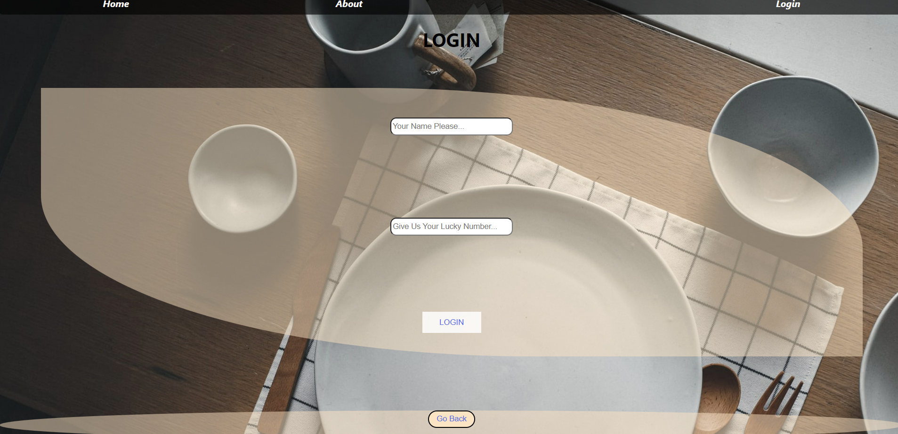
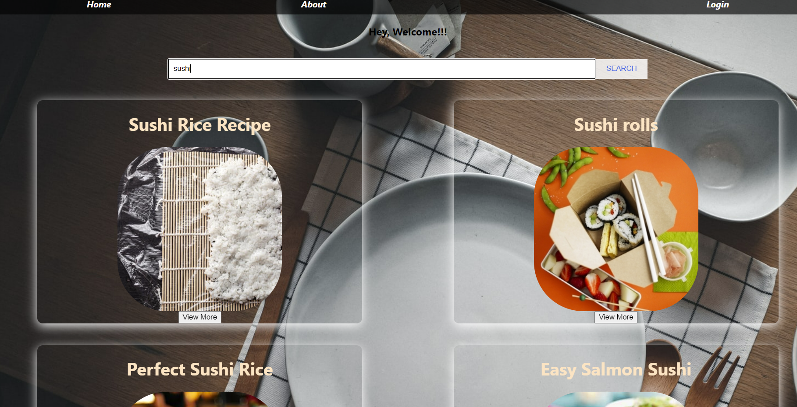
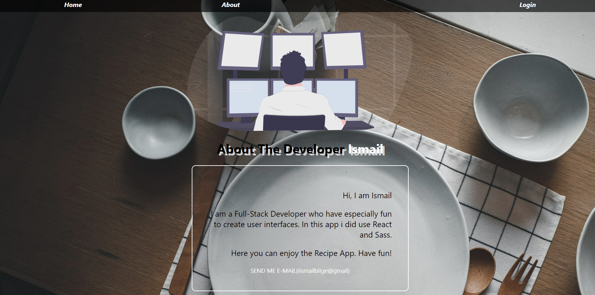

#  :yum: Recipe-App-ettit :spaghetti:
> this app gives you all dishes according to your search. You can view detai informations also.

## Table of contents
  - [Table of contents](#table-of-contents)
  - [General info](#general-info)
  - [Technologies](#technologies)
  - [Features](#features)
  - [How to use](#how-to-use)
  - [Screenshots](#screenshots)
  - [Contact](#contact)

## General info
This project is a React application. And it is working with API from EDAMAM. It is created to sharpen the knowledge of React.js along with props and state property of React  and using local data. It is a part of project week of Coursera IT School - Frontend Developer Course.

## Technologies
* React.js - version 18.2.01
* Sass - version 1.53.0
* Router property of react

## Features
* Gives the search button to seach foods
* Then gives the dishes.
* Click on the virew more button to go details page
* Gives information about developer in about page
* Start with login page

## How to use

Click on this [link](https://recipe-app-etit.vercel.app/login)

## Screenshots

## Contact
:mailbox_with_mail: You can send me email : iismailbilge@gmail.com :mailbox_with_mail:
